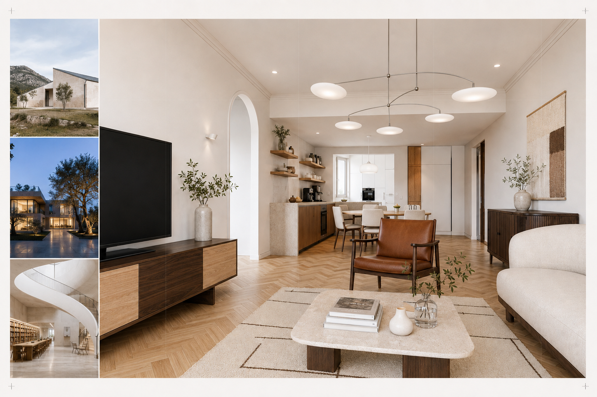
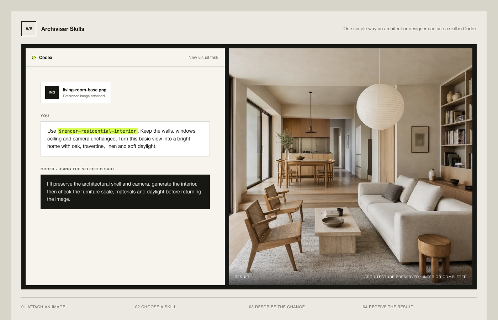
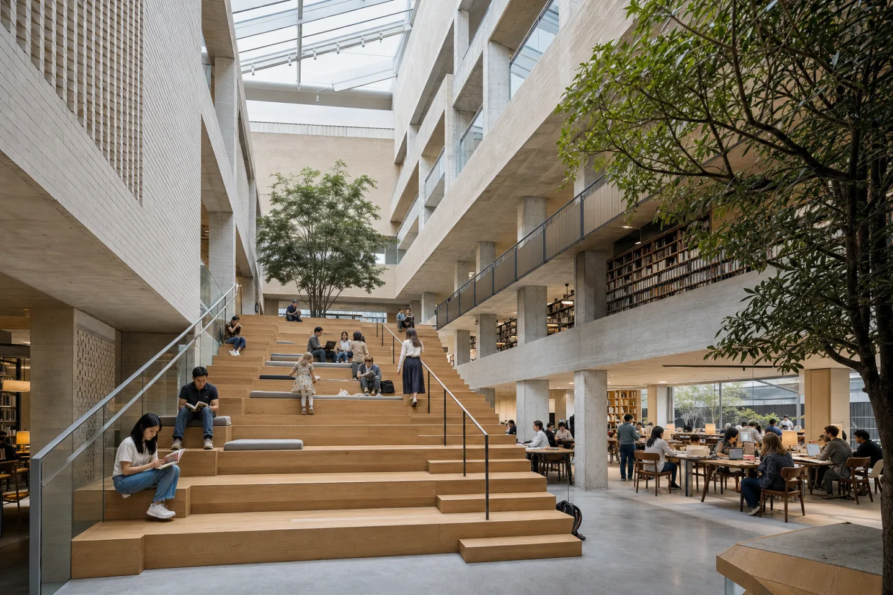
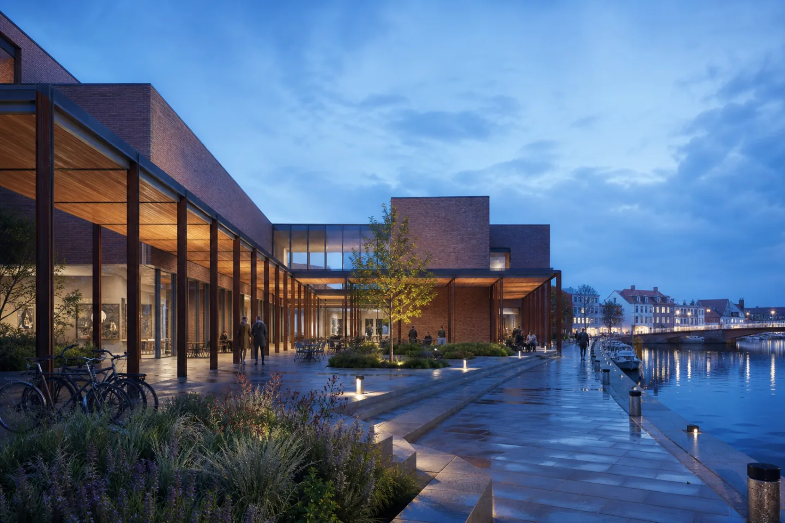
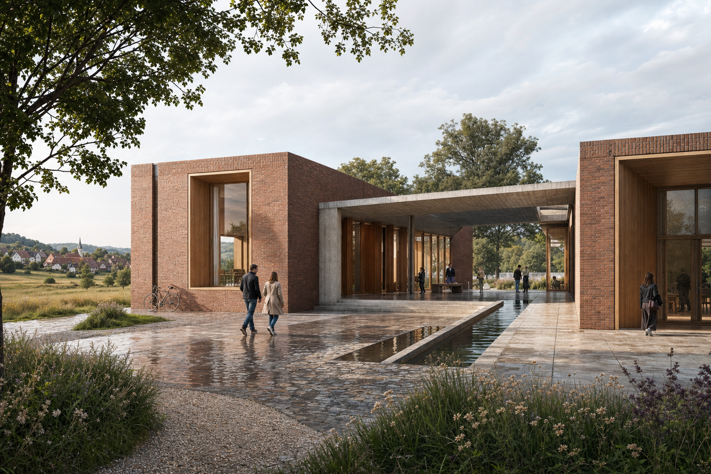
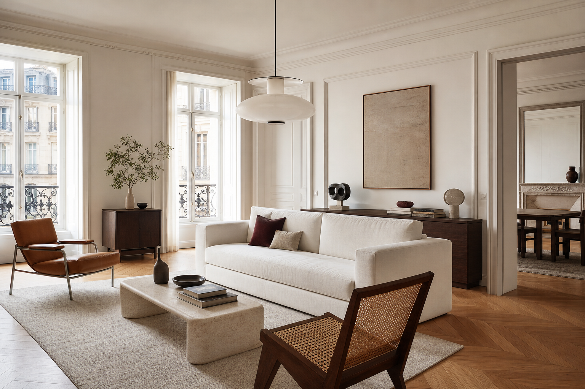
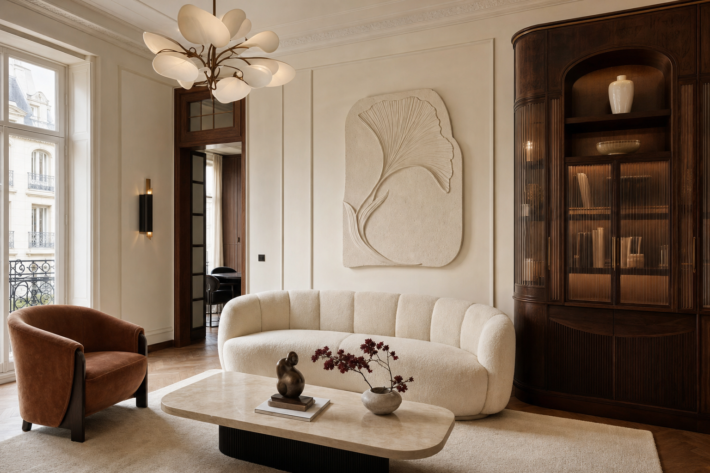

# Archiviser Skills

**Open workflows for architectural imagination.**

Archiviser Skills is a growing open-source collection of ready-made AI workflows for architects and designers.

Give Codex a sketch, screenshot, CG view, or render; choose the skill that matches your task; then describe the result in normal design language. The skill tells the AI what it may change, what must remain fixed, and what to check before returning the image.

The current release begins with ten **architectural visualization** skills. It is not limited to these ten: the collection is actively expanding toward more visualization workflows and future modules for analysis, drawing, modeling, documentation, and presentation.



## Project website

[Open the Archiviser Skills website](https://swangarch.github.io/archiviser/) or view the [local source](site/index.html).

The website starts with an image-first skill gallery. Every skill in the current release has a dedicated example image and a one-line summary. It also shows how a designer uses a skill in Codex and includes practical examples for rendering, object editing, view consistency, and quality restoration.

## A simple example

You do not need to write technical AI prompts. Attach an image and brief Codex as you would brief a visualization artist:

```text
Use $render-residential-interior.
Keep the walls, windows, ceiling and camera unchanged.
Turn this basic view into a bright home with oak, travertine, linen and soft daylight.
```

Codex reads the selected skill, uses the available image-generation tool, preserves the requested architecture, and checks the result before returning it.



## Install in Codex

Add this repository as a plugin marketplace, then install Archiviser Skills:

```bash
codex plugin marketplace add swangarch/archiviser
codex plugin add archiviser-skills@archiviser-skills
```

Start a new Codex thread after installation so the new skills are discovered. A public one-click install URL can replace these commands after the plugin receives a published or workspace share ID.

## What is an AI skill?

Codex is an **AI agent**: an assistant that can read files, follow instructions, use tools such as an image generator, and return the result. A skill is a small set of instructions that teaches the agent how to complete one specific task.

Each Archiviser skill tells the AI:

- which image or document is authoritative;
- what may change and what must remain fixed;
- which visual operation to perform;
- how to inspect the result before delivery.

The skills do not contain an image model. They give an image-capable AI agent a clear workflow, design constraints, and a final checklist.

## Requirements

### Recommended setup

- **Codex or ChatGPT with Agent Skills support**, so the AI can discover and load each workflow;
- **image input**, for reading sketches, screenshots, renders, plans, and visual references;
- **image generation or image editing**, for producing the requested architectural output;
- **multiple-image context**, for geometry references, style references, before/after work, and multiview consistency.

In Codex, invoke a skill explicitly with `$skill-name`; use `$imagegen` when image generation is available. See the official documentation for [building skills](https://learn.chatgpt.com/docs/build-skills) and [image generation](https://learn.chatgpt.com/docs/image-generation).

### Other compatible AI tools

The collection is model-agnostic. Another AI assistant can use it when it can load Markdown instructions, understand images, and generate or edit them. Tool names and attachment steps may differ by platform.

### Text-only fallback

A text-only model can still inspect the workflow, prepare a visual brief, write prompts, and produce a validation checklist. It cannot generate, edit, or visually verify the final image.

## Status

This repository is an early `0.1.0` release. It currently targets multimodal agents and models that can:

- inspect architectural images, sketches, screenshots, or renders;
- generate new images or edit supplied images;
- follow preservation constraints across iterative edits;
- use multiple reference images when a workflow requires view consistency.

On a text-only model, the skills can still prepare briefs and prompts, but they cannot complete the visual output.

## Visualization module

The visualization module is organized as a coordinated studio rather than a flat prompt library. Start with `archviz-director` when the request is ambiguous or combines several operations. Invoke a specialist directly when the intended workflow is already clear.

### Workflow direction

| Skill | Purpose |
| --- | --- |
| [`archviz-director`](skills/archviz-director/) | Inspect inputs, assign reference roles, choose the preservation level, and route the task. |

### Rendering

| Skill | Purpose |
| --- | --- |
| [`render-competition-exterior`](skills/render-competition-exterior/) | Produce editorial competition exteriors from massing, sketches, collages, or basic CG. |
| [`render-public-interior`](skills/render-public-interior/) | Render civic, cultural, educational, and other public interiors with believable activity and material depth. |
| [`render-residential-interior`](skills/render-residential-interior/) | Design and render coherent, bright, editorial residential interiors. |

### Style

| Skill | Purpose |
| --- | --- |
| [`design-modern-french`](skills/design-modern-french/) | Create restrained contemporary French interiors with refined proportions and natural materials. |
| [`design-art-nouveau-deco`](skills/design-art-nouveau-deco/) | Balance Art Nouveau organic line with disciplined Art Deco geometry. |

### Architectural consistency

| Skill | Purpose |
| --- | --- |
| [`lock-architecture-shell`](skills/lock-architecture-shell/) | Protect camera and fixed construction geometry during redesign or re-rendering. |
| [`match-archviz-multiview`](skills/match-archviz-multiview/) | Keep architecture, materials, furniture, and objects consistent across multiple views. |

### Precise editing

| Skill | Purpose |
| --- | --- |
| [`edit-archviz-objects`](skills/edit-archviz-objects/) | Make surgical object or material changes without collateral drift. |

### Image quality

| Skill | Purpose |
| --- | --- |
| [`restore-archviz-quality`](skills/restore-archviz-quality/) | Rebuild degraded image quality while preserving an approved design. |

## Selected outputs

These images are examples of visual direction, not fixed style presets; output varies by model, source image, and prompt. Interactive before/after and multiview examples are available on the [project website](site/index.html).

### Public library interior

[`render-public-interior`](skills/render-public-interior/) — a civic reading hall where structure, circulation, activity, acoustics, and daylight support the same program.



### Blue-hour waterfront exterior

[`render-competition-exterior`](skills/render-competition-exterior/) — a bright post-sunset scene with readable brick architecture, controlled practical lighting, and natural water reflections.



### Competition exterior

[`render-competition-exterior`](skills/render-competition-exterior/) — a rural cultural building with restrained competition atmosphere, credible context, and readable material hierarchy.



### Modern French residential interior

[`design-modern-french`](skills/design-modern-french/) — a bright Parisian living room using calm mouldings, herringbone flooring, walnut, limestone, linen, leather, and negative space.



### Art Nouveau × Art Deco interior

[`design-art-nouveau-deco`](skills/design-art-nouveau-deco/) — a contemporary residential interpretation combining botanical gestures, opaline lighting, dark walnut, ribbed glass, and geometric order.



## How a skill is structured

```text
skills/<skill-name>/
├── SKILL.md                 # Trigger description and core workflow
├── agents/openai.yaml       # User-facing skill metadata
├── references/              # Prompt templates and detailed guidance
└── assets/                  # Optional icons and reusable visual assets
```

The repository follows progressive disclosure: agents first see a skill's name and description, load `SKILL.md` only when the skill is relevant, and read detailed references only when required.

## Using the skills

Install or expose the repository's `skills/` directory to an agent that supports skills, then invoke a skill by name. For example:

```text
Use $archviz-director to inspect these references, decide what geometry is fixed,
and route the project to the right visualization workflow.
```

```text
Use $lock-architecture-shell with $design-modern-french. Preserve every wall,
opening, ceiling level, and the camera; redesign only furniture, finishes, and lighting.
```

```text
Use $match-archviz-multiview to turn these three cameras into separate images of
the same project. Keep materials, fixtures, furniture, and object placement consistent.
```

If your platform does not use `$skill-name` syntax, attach the relevant `SKILL.md` and referenced files to the request.

## Design principles

- **Preserve before generating.** Identify the authoritative geometry and approved design before changing an image.
- **Separate roles.** Distinguish edit targets, geometry sources, approved design sources, and mood references.
- **Compose skills.** Use a design or rendering skill together with geometry locking, multiview matching, or restoration when needed.
- **Change one thing at a time.** Keep iterative feedback narrow so the image does not drift.
- **Validate architectural evidence.** Check openings, levels, circulation, furniture scale, material direction, lighting, and shared anchors across views.
- **Remain model-agnostic.** Describe capabilities and invariants instead of depending on one vendor's prompt syntax.

## Repository layout

```text
.
├── .codex-plugin/plugin.json
├── assets/
│   ├── cover.png
│   └── examples/
├── skills/
│   └── <visualization skills>
├── site/
│   ├── assets/
│   ├── index.html
│   ├── styles.css
│   └── script.js
└── README.md
```

## Contributing

Contributions can add new architectural domains, improve an existing workflow, provide validation examples, or make the skills work more reliably across image-capable models.

Keep each skill focused. Put essential execution instructions in `SKILL.md`, detailed reusable material in `references/`, and output assets in `assets/`. New skill names should use lowercase hyphen-case and each `SKILL.md` should clearly state both what the skill does and when it should trigger.

Before opening a contribution, validate that the workflow protects its declared invariants and that examples do not rely on hidden context.

## Roadmap

- Add sketch-to-render, diagram, collage, and post-production skills.
- Add architecture-analysis, drawing, modeling, documentation, and presentation modules.
- Publish small cross-model evaluation sets for geometry preservation and multiview consistency.
- Add before/after examples based on openly licensed source material.
- Document installation for additional skill-compatible agents and platforms.

## License

A license has not yet been selected. Choose and add an open-source license before the first public release.
